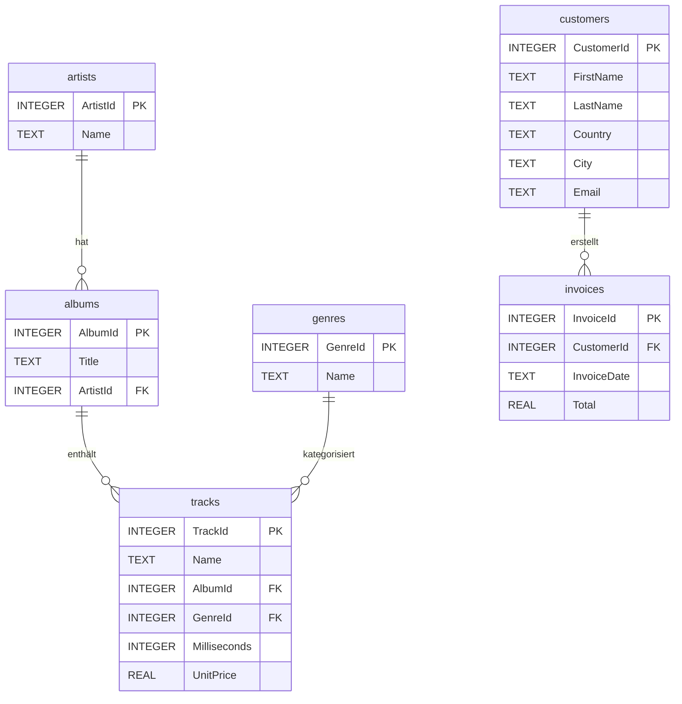

\newpage

# Über diese Übung

### Lernziele

Nach Abschluss dieser Übung können Sie:

- **Verbindungen zu SQLite-Datenbanken** herstellen und schließen
- **SELECT-Abfragen** formulieren und ausführen
- **WHERE-Klauseln** zum Filtern von Daten verwenden
- **ORDER BY** zur Sortierung von Ergebnissen einsetzen
- **Aggregatfunktionen** (COUNT, SUM, AVG) anwenden
- **GROUP BY** für gruppierte Auswertungen nutzen
- **Einfache JOINs** zum Verbinden von Tabellen erstellen
- **Ergebnisse in Python** verarbeiten und ausgeben

**Zeitbedarf**: ca. 90-120 Minuten
**Schwierigkeitsgrad**: Einfach bis Mittel

---

### Voraussetzungen

Für diese Übung sollten Sie folgende Konzepte sicher beherrschen:

- **Variablen und einfache Datentypen** (Notebooks 04-05)
- **Listen und Tupel** (Notebook 06)
- **Schleifen** (Notebook 10: for-Schleifen)
- **Fehlerbehandlung** (Notebook 11: try-except) – für robuste Datenbankoperationen

Diese Übung vertieft die Konzepte aus:

- **Notebook 22: SQLite Grundlagen**
- **Notebook 23: SQLite Vertiefung**

Falls Sie unsicher sind, wiederholen Sie bitte die entsprechenden Notebooks.

---

### Über die Chinook-Datenbank

In dieser Übung arbeiten Sie mit der **Chinook-Datenbank**, einer bekannten Beispieldatenbank, die einen digitalen Musikshop simuliert. Sie enthält Informationen über Künstler, Alben, Tracks, Kunden und Rechnungen.

**Quelle**: SQLite Tutorial (https://www.sqlitetutorial.net/sqlite-sample-database/)

**Dataset-Details:**

| Eigenschaft | Wert |
|-------------|------|
| Datei | `chinook.db` |
| Tabellen | 11 Tabellen |
| Thema | Digitaler Musikshop |
| Sprache | Englische Spaltennamen |

---

### Die wichtigsten Tabellen

Für diese Übung konzentrieren wir uns auf **sechs Tabellen**:

#### Tabelle: artists (Künstler)

| Spalte | Typ | Beschreibung |
|--------|-----|--------------|
| ArtistId | INTEGER | Primärschlüssel |
| Name | TEXT | Name des Künstlers/der Band |

#### Tabelle: albums (Alben)

| Spalte | Typ | Beschreibung |
|--------|-----|--------------|
| AlbumId | INTEGER | Primärschlüssel |
| Title | TEXT | Albumtitel |
| ArtistId | INTEGER | Fremdschlüssel -- artists |

#### Tabelle: tracks (Musikstücke)

| Spalte | Typ | Beschreibung |
|--------|-----|--------------|
| TrackId | INTEGER | Primärschlüssel |
| Name | TEXT | Titel des Tracks |
| AlbumId | INTEGER | Fremdschlüssel -- albums |
| GenreId | INTEGER | Fremdschlüssel -- genres |
| Milliseconds | INTEGER | Länge in Millisekunden |
| UnitPrice | REAL | Preis pro Track |

#### Tabelle: genres (Musikgenres)

| Spalte | Typ | Beschreibung |
|--------|-----|--------------|
| GenreId | INTEGER | Primärschlüssel |
| Name | TEXT | Genre-Bezeichnung (Rock, Jazz, etc.) |

#### Tabelle: customers (Kunden)

| Spalte | Typ | Beschreibung |
|--------|-----|--------------|
| CustomerId | INTEGER | Primärschlüssel |
| FirstName | TEXT | Vorname |
| LastName | TEXT | Nachname |
| Country | TEXT | Land |
| City | TEXT | Stadt |
| Email | TEXT | E-Mail-Adresse |

#### Tabelle: invoices (Rechnungen)

| Spalte | Typ | Beschreibung |
|--------|-----|--------------|
| InvoiceId | INTEGER | Primärschlüssel |
| CustomerId | INTEGER | Fremdschlüssel -- customers |
| InvoiceDate | TEXT | Rechnungsdatum |
| Total | REAL | Gesamtbetrag |

---

### Datenmodell (vereinfacht)

Die Beziehungen zwischen den Tabellen:



**Legende:**

- **PK** = Primärschlüssel (Primary Key)
- **FK** = Fremdschlüssel (Foreign Key)
- Die Linien zeigen 1:n-Beziehungen (ein Künstler hat viele Alben, etc.)

---

### Hinweis zur Bearbeitung

**Dateiorganisation:**

1. Laden Sie die Chinook-Datenbank herunter: https://www.sqlitetutorial.net/wp-content/uploads/2018/03/chinook.zip
2. Entpacken Sie die ZIP-Datei
3. Kopieren Sie `chinook.db` in Ihren Arbeitsordner
4. Erstellen Sie eine Python-Datei oder ein Jupyter Notebook:
   - `uebung_datenbanken.py` oder
   - `uebung_datenbanken.ipynb`

**Wichtig:** Die Datenbankdatei `chinook.db` muss sich im selben Ordner befinden wie Ihre Python-Datei.

\newpage

# Vorbereitung

**Aufwand:** ca. 10 Minuten

### Technische Vorbereitung

1. Erstellen Sie einen neuen Ordner `uebung_datenbanken`
2. Laden Sie `chinook.db` herunter und kopieren Sie sie in diesen Ordner
3. Öffnen Sie Ihre Python-Entwicklungsumgebung
4. Erstellen Sie die Übungsdatei `uebung_datenbanken.py`

### Mentale Vorbereitung

In dieser Übung werden Sie:

1. **Daten abfragen:** Informationen aus der Datenbank lesen
2. **Daten filtern:** Gezielt nach bestimmten Kriterien suchen
3. **Daten aggregieren:** Zusammenfassungen und Statistiken erstellen
4. **Tabellen verbinden:** Informationen aus mehreren Tabellen kombinieren

**Wichtig:** SQL-Befehle werden als Strings in Python geschrieben. Achten Sie auf korrekte Syntax!

### Test der Umgebung

Führen Sie folgenden Code aus:

```python
# Umgebungstest
print("Python-Umgebung wird getestet...")

# Test: sqlite3 importieren
import sqlite3
print("[OK] sqlite3 importiert")

# Test: Verbindung zur Datenbank herstellen
try:
    verbindung = sqlite3.connect('chinook.db')
    cursor = verbindung.cursor()
    print("[OK] Verbindung zur Datenbank hergestellt")

    # Test: Einfache Abfrage
    cursor.execute("SELECT COUNT(*) FROM artists")
    anzahl = cursor.fetchone()[0]
    print(f"[OK] Datenbank enthält {anzahl} Künstler")

    # Verbindung schließen
    verbindung.close()
    print("[OK] Verbindung geschlossen")

except sqlite3.Error as e:
    print(f"[FEHLER] Datenbankfehler: {e}")
    print("Stellen Sie sicher, dass 'chinook.db' im gleichen Ordner liegt!")

print("\n[OK] Alle Tests bestanden - Sie können beginnen!")
```

**Erwartete Ausgabe:**
```
Python-Umgebung wird getestet...
[OK] sqlite3 importiert
[OK] Verbindung zur Datenbank hergestellt
[OK] Datenbank enthält 275 Künstler
[OK] Verbindung geschlossen

[OK] Alle Tests bestanden - Sie können beginnen!
```

\newpage

# Block A – Verbindung und erste Abfragen

**Fortschritt:** [##________] 20% der Übung

**Aufwand:** ca. 15-20 Minuten

In diesem Block lernen Sie, eine Verbindung zur Datenbank herzustellen und einfache Abfragen auszuführen.

> **Info-Box: Grundlegende Datenbankoperationen**
>
> Das Muster für Datenbankabfragen in Python:
> ```python
> import sqlite3
>
> verbindung = sqlite3.connect('datenbankname.db')
> cursor = verbindung.cursor()
> cursor.execute("SQL-BEFEHL")
> ergebnisse = cursor.fetchall()
> verbindung.close()
> ```
>
> - `connect()` öffnet die Verbindung
> - `cursor()` erstellt ein Werkzeug für Abfragen
> - `execute()` führt den SQL-Befehl aus
> - `fetchall()` holt alle Ergebnisse
> - `close()` schließt die Verbindung

> **Info-Box: LIMIT – Ergebnisse begrenzen**
>
> Mit `LIMIT` können Sie die Anzahl der zurückgegebenen Zeilen begrenzen:
> ```sql
> SELECT * FROM tabelle LIMIT 10
> ```
> Diese Abfrage gibt nur die ersten 10 Zeilen zurück. Das ist nützlich, um:
> - Große Datenmengen übersichtlich zu halten
> - Schnell einen Überblick über die Daten zu bekommen
> - Die Ausgabe auf eine bestimmte Anzahl zu beschränken
>
> `LIMIT` steht immer am **Ende** der SQL-Abfrage.

---

## Aufgabe 1: Alle Künstler anzeigen
**Schwierigkeit:** [EINFACH]

### Aufgabenstellung

Schreiben Sie ein Programm, das die ersten 10 Künstler aus der Datenbank ausgibt.

1. Stellen Sie eine Verbindung zur Datenbank `chinook.db` her
2. Führen Sie die Abfrage `SELECT * FROM artists LIMIT 10` aus
3. Geben Sie jeden Künstler mit ID und Namen aus
4. Schließen Sie die Verbindung

---

### Hilfestellungen

**Benötigte SQL-Konzepte:**
- `SELECT` wählt Spalten aus (Notebook 22)
- `FROM` gibt die Tabelle an (Notebook 22)
- `LIMIT` begrenzt die Anzahl der Ergebnisse (siehe Info-Box oben)

**Relevante Tabelle:**
- `artists` mit Spalten: `ArtistId`, `Name`

**Python-Struktur:**
1. `sqlite3` importieren
2. Verbindung mit `connect()` herstellen
3. Cursor erstellen
4. SQL-Befehl mit `execute()` ausführen
5. Ergebnisse mit `fetchall()` holen
6. Mit for-Schleife ausgeben
7. Verbindung schließen

**Denkanstoß:**
- Wie wählen Sie alle Spalten einer Tabelle aus?
- Wie begrenzen Sie die Ausgabe auf genau 10 Einträge?

---

#### **Erwartete Ausgabe**

```
Die ersten 10 Künstler:
ID: 1, Name: AC/DC
ID: 2, Name: Accept
ID: 3, Name: Aerosmith
ID: 4, Name: Alanis Morissette
ID: 5, Name: Alice In Chains
ID: 6, Name: Antônio Carlos Jobim
ID: 7, Name: Apocalyptica
ID: 8, Name: Audioslave
ID: 9, Name: BackBeat
ID: 10, Name: Billy Cobham
```

---

## Aufgabe 2: Anzahl der Tabellen ermitteln
**Schwierigkeit:** [EINFACH]

### Aufgabenstellung

Ermitteln Sie, wie viele Einträge in den verschiedenen Tabellen vorhanden sind.

1. Zählen Sie die Anzahl der Künstler (`artists`)
2. Zählen Sie die Anzahl der Alben (`albums`)
3. Zählen Sie die Anzahl der Tracks (`tracks`)
4. Geben Sie alle drei Zahlen aus

**Hinweis:** Verwenden Sie `SELECT COUNT(*) FROM tabellenname`

---

### Hilfestellungen

**Benötigte SQL-Konzepte:**
- `COUNT(*)` zählt alle Zeilen einer Tabelle (Notebook 23)
- Sie können mehrere Abfragen nacheinander mit demselben Cursor ausführen

**Relevante Tabellen:**
- `artists`, `albums`, `tracks`

**Python-Hinweis:**
- `fetchone()` holt genau eine Zeile als Tupel
- `fetchone()[0]` gibt den ersten Wert des Tupels zurück

**Denkanstoß:**
- Wie formulieren Sie eine Abfrage, die nur die Anzahl der Zeilen zurückgibt?

---

#### **Erwartete Ausgabe**

```
Datenbankübersicht:
Anzahl Künstler: 275
Anzahl Alben: 347
Anzahl Tracks: 3503
```

---

## Aufgabe 3: Alle Genres auflisten
**Schwierigkeit:** [EINFACH]

### Aufgabenstellung

Listen Sie alle verfügbaren Musikgenres auf.

1. Fragen Sie alle Genres aus der Tabelle `genres` ab
2. Geben Sie die ID und den Namen jedes Genres aus
3. Zählen Sie am Ende, wie viele Genres es insgesamt gibt

---

### Hilfestellungen

**Benötigte SQL-Konzepte:**
- `SELECT` und `FROM` für einfache Abfragen (Notebook 22)
- Ohne `LIMIT` werden alle Einträge zurückgegeben

**Relevante Tabelle:**
- `genres` mit Spalten: `GenreId`, `Name`

**Python-Hinweis:**
- `len()` gibt die Anzahl der Elemente in einer Liste zurück

**Denkanstoß:**
- Wie unterscheidet sich diese Abfrage von Aufgabe 1?

---

#### **Erwartete Ausgabe**

```
Verfügbare Genres:
ID: 1, Genre: Rock
ID: 2, Genre: Jazz
ID: 3, Genre: Metal
...
ID: 25, Genre: Opera

Insgesamt: 25 Genres
```

\newpage

# Block B – Daten filtern mit WHERE

**Fortschritt:** [####______] 40% der Übung

**Aufwand:** ca. 20-25 Minuten

In diesem Block lernen Sie, Daten gezielt zu filtern und zu sortieren.

> **Info-Box: WHERE-Klausel**
>
> Mit WHERE filtern Sie Ergebnisse nach Bedingungen:
> ```sql
> SELECT spalten FROM tabelle WHERE bedingung
> ```
>
> Wichtige Operatoren:
> - `=` gleich
> - `!=` oder `<>` ungleich
> - `>`, `<`, `>=`, `<=` Vergleiche
> - `LIKE` Textmuster (mit `%` als Platzhalter)
> - `AND`, `OR` Verknüpfung mehrerer Bedingungen

---

## Aufgabe 4: Kunden aus einem Land
**Schwierigkeit:** [EINFACH]

### Aufgabenstellung

Finden Sie alle Kunden aus Deutschland.

1. Fragen Sie Vorname, Nachname und Stadt aller Kunden ab, deren Land `'Germany'` ist
2. Geben Sie die gefundenen Kunden aus
3. Zählen Sie, wie viele deutsche Kunden es gibt

**Hinweis:** Die Spalte heißt `Country` und der Wert muss `'Germany'` sein (englisch).

---

### Hilfestellungen

**Benötigte SQL-Konzepte:**
- `WHERE` filtert Ergebnisse nach einer Bedingung (Notebook 23)
- Textwerte müssen in einfachen Anführungszeichen stehen: `'Wert'`

**Relevante Tabelle:**
- `customers` mit Spalten: `FirstName`, `LastName`, `City`, `Country`

**Denkanstoß:**
- Wie formulieren Sie eine Bedingung, die prüft, ob eine Spalte einen bestimmten Wert hat?
- Die Spaltennamen und Werte sind auf Englisch (`Country`, `'Germany'`)

---

#### **Erwartete Ausgabe**

```
Kunden aus Deutschland:
Leonie Köhler aus Stuttgart
Hannah Schneider aus Berlin
Fynn Zimmermann aus Frankfurt

Anzahl deutsche Kunden: 4
```

---

## Aufgabe 5: Tracks nach Preis filtern
**Schwierigkeit:** [EINFACH]

### Aufgabenstellung

Finden Sie alle Tracks, die mehr als 0.99 kosten.

1. Fragen Sie Name und Preis aller Tracks ab, deren `UnitPrice > 0.99`
2. Begrenzen Sie die Ausgabe auf die ersten 10 Ergebnisse
3. Geben Sie die Tracks mit ihrem Preis aus

---

### Hilfestellungen

**Benötigte SQL-Konzepte:**
- `WHERE` mit Vergleichsoperator `>` (größer als)
- `LIMIT` zur Begrenzung der Ergebnisse

**Relevante Tabelle:**
- `tracks` mit Spalten: `Name`, `UnitPrice`

**Denkanstoß:**
- Wie kombinieren Sie WHERE und LIMIT in einer Abfrage?
- In welcher Reihenfolge stehen die Klauseln?

---

#### **Erwartete Ausgabe**

```
Tracks mit Preis > 0.99€:
Balls to the Wall - Preis: 1.99€
Fast As a Shark - Preis: 1.99€
Restless and Wild - Preis: 1.99€
...
```

---

## Aufgabe 6: Künstler suchen mit LIKE
**Schwierigkeit:** [MITTEL]

### Aufgabenstellung

Suchen Sie nach Künstlern, deren Name mit "The" beginnt.

1. Verwenden Sie `LIKE 'The%'` um Namen zu finden, die mit "The" beginnen
2. Das `%` ist ein Platzhalter für beliebig viele Zeichen
3. Geben Sie alle gefundenen Künstler aus

---

### Hilfestellungen

**Benötigte SQL-Konzepte:**
- `LIKE` sucht nach Textmustern (Notebook 23)
- `%` ist ein Platzhalter für beliebig viele Zeichen

**Relevante Tabelle:**
- `artists` mit Spalten: `ArtistId`, `Name`

**Denkanstoß:**
- Wo muss der Platzhalter `%` stehen, wenn Sie nach Namen suchen, die mit einem bestimmten Text **beginnen**?
- Wo müsste `%` stehen für "enthält"?

---

#### **Erwartete Ausgabe**

```
Künstler, die mit "The" beginnen:
ID: 18, Name: The Black Crowes
ID: 67, Name: The Cult
ID: 82, Name: The Doors
ID: 118, Name: The Office
...
```

---

## Aufgabe 7: Tracks mit mehreren Bedingungen
**Schwierigkeit:** [MITTEL]

### Aufgabenstellung

Finden Sie alle Tracks, die:
- Zum Genre mit der ID 1 (Rock) gehören **UND**
- Länger als 300.000 Millisekunden (5 Minuten) sind

1. Kombinieren Sie beide Bedingungen mit `AND`
2. Geben Sie Name und Länge in Minuten aus
3. Begrenzen Sie auf 10 Ergebnisse

**Hinweis:** Um Millisekunden in Minuten umzurechnen: `Milliseconds / 60000`

---

### Hilfestellungen

**Benötigte SQL-Konzepte:**
- `AND` verknüpft mehrere Bedingungen (beide müssen erfüllt sein)
- Vergleichsoperatoren: `=` für Gleichheit, `>` für größer als

**Relevante Tabelle:**
- `tracks` mit Spalten: `Name`, `GenreId`, `Milliseconds`

**Python-Hinweis:**
- Umrechnung: Millisekunden / 60000 = Minuten
- Formatierung auf 2 Nachkommastellen: `f"{wert:.2f}"`

**Denkanstoß:**
- Wie formulieren Sie eine WHERE-Klausel mit zwei Bedingungen?

---

#### **Erwartete Ausgabe**

```
Lange Rock-Tracks (> 5 Minuten):
Spellbound - 5.05 Minuten
Machine Men - 5.06 Minuten
...
```

\newpage

# Block C – Sortieren und Aggregieren

**Fortschritt:** [######____] 60% der Übung

**Aufwand:** ca. 20-25 Minuten

In diesem Block lernen Sie, Ergebnisse zu sortieren und zusammenzufassen.

> **Info-Box: ORDER BY und Aggregatfunktionen**
>
> **Sortieren:**
> ```sql
> SELECT * FROM tabelle ORDER BY spalte ASC   -- aufsteigend (Standard)
> SELECT * FROM tabelle ORDER BY spalte DESC  -- absteigend
> ```
>
> **Aggregatfunktionen:**
> - `COUNT(*)` - Anzahl der Zeilen
> - `SUM(spalte)` - Summe der Werte
> - `AVG(spalte)` - Durchschnitt
> - `MIN(spalte)` - Minimum
> - `MAX(spalte)` - Maximum

---

## Aufgabe 8: Teuerste Tracks finden
**Schwierigkeit:** [EINFACH]

### Aufgabenstellung

Finden Sie die 10 teuersten Tracks in der Datenbank.

1. Sortieren Sie nach `UnitPrice` absteigend (`DESC`)
2. Begrenzen Sie auf 10 Ergebnisse
3. Geben Sie Name und Preis aus

---

### Hilfestellungen

**Benötigte SQL-Konzepte:**
- `ORDER BY` sortiert Ergebnisse
- `DESC` = absteigend (höchster Wert zuerst), `ASC` = aufsteigend

**Relevante Tabelle:**
- `tracks` mit Spalten: `Name`, `UnitPrice`

**Denkanstoß:**
- Nach welcher Spalte müssen Sie sortieren, um die teuersten Tracks zu finden?
- In welche Richtung (aufsteigend oder absteigend)?

---

#### **Erwartete Ausgabe**

```
Die 10 teuersten Tracks:
1. Battlestar Galactica, Teknoman, etc. - 1.99€
2. ...
...
```

---

## Aufgabe 9: Statistiken berechnen
**Schwierigkeit:** [MITTEL]

### Aufgabenstellung

Berechnen Sie folgende Statistiken für die Tracks-Tabelle:

1. **Gesamtanzahl** aller Tracks
2. **Durchschnittspreis** aller Tracks
3. **Längster Track** (Maximum der Milliseconds, umgerechnet in Minuten)
4. **Kürzester Track** (Minimum der Milliseconds, umgerechnet in Minuten)
5. **Gesamtdauer** aller Tracks in Stunden

---

### Hilfestellungen

**Benötigte SQL-Konzepte (Aggregatfunktionen):**
- `COUNT(*)` - Anzahl der Zeilen
- `AVG(spalte)` - Durchschnitt
- `MAX(spalte)` - Maximum
- `MIN(spalte)` - Minimum
- `SUM(spalte)` - Summe

**Relevante Tabelle:**
- `tracks` mit Spalten: `UnitPrice`, `Milliseconds`

**Python-Hinweis:**
- Mehrere Aggregatfunktionen können in einer SELECT-Abfrage kombiniert werden
- Umrechnungen: ms / 60000 = Minuten, ms / 3600000 = Stunden

**Denkanstoß:**
- Wie formulieren Sie eine Abfrage, die mehrere Statistiken gleichzeitig berechnet?

---

#### **Erwartete Ausgabe**

```
=== Track-Statistiken ===
Anzahl Tracks: 3503
Durchschnittspreis: 1.05€
Längster Track: 90.23 Minuten
Kürzester Track: 0.03 Minuten
Gesamtdauer aller Tracks: 389.83 Stunden
```

---

## Aufgabe 10: Kunden alphabetisch sortiert
**Schwierigkeit:** [EINFACH]

### Aufgabenstellung

Listen Sie alle Kunden alphabetisch nach Nachname auf.

1. Wählen Sie Vorname, Nachname und Land
2. Sortieren Sie nach `LastName` aufsteigend (`ASC`)
3. Begrenzen Sie auf 15 Ergebnisse

---

### Hilfestellungen

**Benötigte SQL-Konzepte:**
- `ORDER BY` mit Sortierrichtung

**Relevante Tabelle:**
- `customers` mit Spalten: `FirstName`, `LastName`, `Country`

**Denkanstoß:**
- Nach welcher Spalte sortieren Sie für alphabetische Reihenfolge nach Nachname?

---

#### **Erwartete Ausgabe**

```
Kunden (alphabetisch nach Nachname):
Roberto Almeida aus Brazil
Julia Barnett aus USA
...
```

\newpage

# Block D – Gruppieren mit GROUP BY

**Fortschritt:** [########__] 80% der Übung

**Aufwand:** ca. 20-25 Minuten

In diesem Block lernen Sie, Daten zu gruppieren und pro Gruppe auszuwerten.

> **Info-Box: GROUP BY**
>
> `GROUP BY` fasst Zeilen mit gleichen Werten zusammen:
> ```sql
> SELECT spalte, COUNT(*)
> FROM tabelle
> GROUP BY spalte
> ```
>
> Beispiel: "Wie viele Tracks gibt es pro Genre?"
> ```sql
> SELECT GenreId, COUNT(*) FROM tracks GROUP BY GenreId
> ```
>
> **Wichtig:** Bei GROUP BY müssen alle SELECT-Spalten entweder:
> - In GROUP BY vorkommen, ODER
> - Aggregatfunktionen sein (COUNT, SUM, AVG, etc.)

---

## Aufgabe 11: Tracks pro Genre zählen
**Schwierigkeit:** [MITTEL]

### Aufgabenstellung

Zählen Sie, wie viele Tracks es pro Genre gibt.

1. Gruppieren Sie die Tracks nach `GenreId`
2. Zählen Sie die Tracks pro Gruppe
3. Sortieren Sie nach Anzahl absteigend
4. Geben Sie GenreId und Anzahl aus

---

### Hilfestellungen

**Konzept:**
`GROUP BY` fasst Zeilen mit gleichen Werten zusammen. Aggregatfunktionen wie `COUNT(*)` berechnen dann einen Wert pro Gruppe.

**Relevante Tabelle:**
- `tracks` mit Spalte `GenreId`

**Denkanstoß:**
- Wie kombinieren Sie GROUP BY mit COUNT(*)?
- Wie sortieren Sie nach dem Ergebnis einer Aggregatfunktion?

---

#### **Erwartete Ausgabe**

```
Tracks pro Genre:
Genre 1: 1297 Tracks
Genre 2: 130 Tracks
Genre 3: 374 Tracks
...
```

---

## Aufgabe 12: Umsatz pro Land berechnen
**Schwierigkeit:** [MITTEL]

### Aufgabenstellung

Berechnen Sie den Gesamtumsatz pro Land der Kunden.

**Hinweis:** Diese Aufgabe erfordert einen **JOIN** zwischen `customers` und `invoices`.

1. Verbinden Sie die Tabellen `customers` und `invoices` über `CustomerId`
2. Gruppieren Sie nach `Country`
3. Summieren Sie `Total` pro Land
4. Sortieren Sie nach Umsatz absteigend
5. Zeigen Sie die Top 10 Länder

---

### Hilfestellungen

**Konzept:**
Diese Aufgabe erfordert einen `INNER JOIN`, um zwei Tabellen zu verbinden. Die Verbindung erfolgt über den gemeinsamen Schlüssel `CustomerId`.

**Relevante Tabellen:**
- `customers` mit Spalten: `CustomerId`, `Country`
- `invoices` mit Spalten: `CustomerId`, `Total`

**Denkanstoß:**
- Wie verbinden Sie zwei Tabellen über einen gemeinsamen Schlüssel?
- Wie kombinieren Sie JOIN mit GROUP BY?

---

#### **Erwartete Ausgabe**

```
Top 10 Länder nach Umsatz:
USA: 523.06€
Canada: 303.96€
France: 195.10€
Brazil: 190.10€
Germany: 156.48€
...
```

---

## Aufgabe 13: Durchschnittliche Tracklänge pro Album
**Schwierigkeit:** [MITTEL]

### Aufgabenstellung

Berechnen Sie die durchschnittliche Tracklänge (in Minuten) pro Album.

1. Gruppieren Sie Tracks nach `AlbumId`
2. Berechnen Sie den Durchschnitt von `Milliseconds`
3. Sortieren Sie nach durchschnittlicher Länge absteigend
4. Zeigen Sie die Top 10 Alben mit den längsten durchschnittlichen Tracks

---

### Hilfestellungen

**Konzept:**
`AVG()` berechnet den Durchschnitt einer Spalte. In Kombination mit `GROUP BY` erhalten Sie den Durchschnitt pro Gruppe.

**Relevante Tabelle:**
- `tracks` mit Spalten: `AlbumId`, `Milliseconds`

**Denkanstoß:**
- Wie berechnen Sie den Durchschnitt pro Album?
- Die Umrechnung in Minuten erfolgt in Python.

---

#### **Erwartete Ausgabe**

```
Top 10 Alben nach durchschnittlicher Tracklänge:
Album 229: 45.11 Minuten im Durchschnitt
Album 227: 42.50 Minuten im Durchschnitt
...
```

\newpage

# Block E – Tabellen verbinden (JOIN)

**Fortschritt:** [#########_] 90% der Übung

**Aufwand:** ca. 15-20 Minuten

In diesem Block lernen Sie, Informationen aus mehreren Tabellen zu kombinieren.

> **Info-Box: INNER JOIN**
>
> Ein JOIN verbindet Zeilen aus zwei Tabellen basierend auf einer Beziehung:
> ```sql
> SELECT tabelle1.spalte, tabelle2.spalte
> FROM tabelle1
> INNER JOIN tabelle2 ON tabelle1.schluessel = tabelle2.schluessel
> ```
>
> **Beispiel:** Künstler und ihre Alben verbinden:
> ```sql
> SELECT artists.Name, albums.Title
> FROM artists
> INNER JOIN albums ON artists.ArtistId = albums.ArtistId
> ```

---

## Aufgabe 14: Alben mit Künstlernamen anzeigen
**Schwierigkeit:** [MITTEL]

### Aufgabenstellung

Listen Sie Alben zusammen mit dem Namen des Künstlers auf.

1. Verbinden Sie `albums` mit `artists` über `ArtistId`
2. Wählen Sie den Album-Titel und den Künstler-Namen
3. Sortieren Sie nach Künstlername
4. Begrenzen Sie auf 20 Ergebnisse

---

### Hilfestellungen

**Relevante Tabellen:**
- `albums` mit Spalten: `Title`, `ArtistId`
- `artists` mit Spalten: `ArtistId`, `Name`

**Hinweis:**
Die Tabellen sind über `ArtistId` verbunden.

---

#### **Erwartete Ausgabe**

```
Alben mit Künstlern:
For Those About To Rock We Salute You - von AC/DC
Let There Be Rock - von AC/DC
Balls to the Wall - von Accept
Restless and Wild - von Accept
Big Ones - von Aerosmith
...
```

---

## Aufgabe 15: Tracks mit Genre-Namen anzeigen
**Schwierigkeit:** [MITTEL]

### Aufgabenstellung

Zeigen Sie Tracks zusammen mit dem Namen ihres Genres an (nicht nur die GenreId).

1. Verbinden Sie `tracks` mit `genres` über `GenreId`
2. Wählen Sie Track-Name und Genre-Name
3. Filtern Sie nach Rock-Tracks (Genre-Name = 'Rock')
4. Begrenzen Sie auf 15 Ergebnisse

---

### Hilfestellungen

**Relevante Tabellen:**
- `tracks` mit Spalten: `Name`, `GenreId`
- `genres` mit Spalten: `GenreId`, `Name`

**Hinweis:**
Beide Tabellen haben eine Spalte `Name`. Unterscheiden Sie mit `tabellenname.spaltenname`.

---

#### **Erwartete Ausgabe**

```
Rock-Tracks:
For Those About To Rock (We Salute You) - Genre: Rock
Put The Finger On You - Genre: Rock
Let's Get It Up - Genre: Rock
...
```

\newpage

# Komplexaufgabe

**Fortschritt:** [##########] 100% der Übung

**Aufwand:** ca. 20-25 Minuten

Diese Aufgabe kombiniert mehrere der gelernten Konzepte.

---

## Aufgabe 16: Musikshop-Bericht erstellen
**Schwierigkeit:** [SCHWER]

### Aufgabenstellung

Erstellen Sie einen umfassenden Bericht über den Musikshop mit folgenden Informationen:

**Teil 1 - Bestandsübersicht:**
- Anzahl Künstler, Alben und Tracks
- Gesamtwert aller Tracks (Summe aller UnitPrice)
- Durchschnittspreis pro Track

**Teil 2 - Top-Statistiken:**
- Die 5 Genres mit den meisten Tracks
- Die 3 Länder mit dem höchsten Umsatz (JOIN erforderlich)

**Teil 3 - Ausgabe formatieren:**
- Verwenden Sie Trennlinien und Überschriften
- Runden Sie Geldbeträge auf 2 Nachkommastellen

---

### Hinweis

Diese Aufgabe ist eine **selbstständige Übung** ohne Hilfestellungen. Nutzen Sie Ihr Wissen aus den vorherigen Aufgaben, um den Bericht zu erstellen.

**Tipp:** Orientieren Sie sich an der erwarteten Ausgabe, um die benötigten Abfragen zu identifizieren.

---

#### **Erwartete Ausgabe**

```
========================================
       MUSIKSHOP-BERICHT
========================================

=== BESTANDSÜBERSICHT ===
Anzahl Künstler:     275
Anzahl Alben:        347
Anzahl Tracks:       3503
Gesamtwert:          3680.97€
Durchschnittspreis:  1.05€

=== TOP 5 GENRES (nach Anzahl Tracks) ===
1. Genre 1: 1297 Tracks
2. Genre 3: 374 Tracks
3. Genre 4: 332 Tracks
4. Genre 2: 130 Tracks
5. Genre 6: 81 Tracks

=== TOP 3 LÄNDER (nach Umsatz) ===
1. USA: 523.06€
2. Canada: 303.96€
3. France: 195.10€

========================================
```

\newpage

# Musterlösungen

### Lösung zu Aufgabe 1: Alle Künstler anzeigen

<details>
<summary>Lösung anzeigen</summary>

```python
# Aufgabe 1: Alle Künstler anzeigen

import sqlite3

# Verbindung herstellen
verbindung = sqlite3.connect('chinook.db')
cursor = verbindung.cursor()

# Abfrage ausführen
cursor.execute("SELECT * FROM artists LIMIT 10")
kuenstler = cursor.fetchall()

# Ergebnisse ausgeben
print("Die ersten 10 Künstler:")
for k in kuenstler:
    print(f"ID: {k[0]}, Name: {k[1]}")

# Verbindung schließen
verbindung.close()
```

**Erklärung:**
- `connect()` öffnet die Datenbankdatei
- `cursor()` erstellt ein Objekt für Abfragen
- `execute()` führt den SQL-Befehl aus
- `fetchall()` gibt eine Liste von Tupeln zurück
- Jedes Tupel enthält eine Zeile: `(ArtistId, Name)`

**Verwendete Konzepte:**
- Datenbankverbindung
- SELECT-Abfrage mit LIMIT
- for-Schleife über Ergebnisse

</details>

---

### Lösung zu Aufgabe 2: Anzahl der Tabellen ermitteln

<details>
<summary>Lösung anzeigen</summary>

```python
# Aufgabe 2: Anzahl der Tabellen ermitteln

import sqlite3

verbindung = sqlite3.connect('chinook.db')
cursor = verbindung.cursor()

# Künstler zählen
cursor.execute("SELECT COUNT(*) FROM artists")
anzahl_kuenstler = cursor.fetchone()[0]

# Alben zählen
cursor.execute("SELECT COUNT(*) FROM albums")
anzahl_alben = cursor.fetchone()[0]

# Tracks zählen
cursor.execute("SELECT COUNT(*) FROM tracks")
anzahl_tracks = cursor.fetchone()[0]

# Ausgabe
print("Datenbankübersicht:")
print(f"Anzahl Künstler: {anzahl_kuenstler}")
print(f"Anzahl Alben: {anzahl_alben}")
print(f"Anzahl Tracks: {anzahl_tracks}")

verbindung.close()
```

**Erklärung:**
- `COUNT(*)` zählt alle Zeilen einer Tabelle
- `fetchone()` holt genau eine Zeile (bei COUNT nur ein Wert)
- `[0]` greift auf das erste Element des Tupels zu

**Verwendete Konzepte:**
- Aggregatfunktion COUNT
- fetchone() statt fetchall()
- Indexzugriff auf Tupel

</details>

---

### Lösung zu Aufgabe 3: Alle Genres auflisten

<details>
<summary>Lösung anzeigen</summary>

```python
# Aufgabe 3: Alle Genres auflisten

import sqlite3

verbindung = sqlite3.connect('chinook.db')
cursor = verbindung.cursor()

# Alle Genres abfragen
cursor.execute("SELECT * FROM genres")
genres = cursor.fetchall()

# Ausgabe
print("Verfügbare Genres:")
for genre in genres:
    print(f"ID: {genre[0]}, Genre: {genre[1]}")

print(f"\nInsgesamt: {len(genres)} Genres")

verbindung.close()
```

**Erklärung:**
- Keine LIMIT-Klausel -> alle Einträge werden geholt
- `len()` zählt die Elemente der Liste

**Verwendete Konzepte:**
- SELECT ohne LIMIT
- len() für Anzahl

</details>

---

### Lösung zu Aufgabe 4: Kunden aus einem Land

<details>
<summary>Lösung anzeigen</summary>

```python
# Aufgabe 4: Kunden aus einem Land

import sqlite3

verbindung = sqlite3.connect('chinook.db')
cursor = verbindung.cursor()

# Kunden aus Deutschland abfragen
sql = "SELECT FirstName, LastName, City FROM customers WHERE Country = 'Germany'"
cursor.execute(sql)
kunden = cursor.fetchall()

# Ausgabe
print("Kunden aus Deutschland:")
for kunde in kunden:
    print(f"{kunde[0]} {kunde[1]} aus {kunde[2]}")

print(f"\nAnzahl deutsche Kunden: {len(kunden)}")

verbindung.close()
```

**Erklärung:**
- `WHERE Country = 'Germany'` filtert nach dem Land
- Strings in SQL müssen in einfachen Anführungszeichen stehen
- Die SQL-Abfrage ist ein Python-String (daher doppelte Anführungszeichen außen)

**Verwendete Konzepte:**
- WHERE-Klausel
- String-Vergleich in SQL

</details>

---

### Lösung zu Aufgabe 5: Tracks nach Preis filtern

<details>
<summary>Lösung anzeigen</summary>

```python
# Aufgabe 5: Tracks nach Preis filtern

import sqlite3

verbindung = sqlite3.connect('chinook.db')
cursor = verbindung.cursor()

# Teure Tracks abfragen
sql = "SELECT Name, UnitPrice FROM tracks WHERE UnitPrice > 0.99 LIMIT 10"
cursor.execute(sql)
tracks = cursor.fetchall()

# Ausgabe
print("Tracks mit Preis > 0.99€:")
for track in tracks:
    print(f"{track[0]} - Preis: {track[1]}€")

verbindung.close()
```

**Erklärung:**
- `WHERE UnitPrice > 0.99` filtert nach Preis
- Zahlen brauchen keine Anführungszeichen in SQL

**Verwendete Konzepte:**
- WHERE mit Zahlenvergleich
- Kombination von WHERE und LIMIT

</details>

---

### Lösung zu Aufgabe 6: Künstler suchen mit LIKE

<details>
<summary>Lösung anzeigen</summary>

```python
# Aufgabe 6: Künstler suchen mit LIKE

import sqlite3

verbindung = sqlite3.connect('chinook.db')
cursor = verbindung.cursor()

# Künstler suchen, die mit "The" beginnen
sql = "SELECT * FROM artists WHERE Name LIKE 'The%'"
cursor.execute(sql)
kuenstler = cursor.fetchall()

# Ausgabe
print('Künstler, die mit "The" beginnen:')
for k in kuenstler:
    print(f"ID: {k[0]}, Name: {k[1]}")

print(f"\nGefunden: {len(kuenstler)} Künstler")

verbindung.close()
```

**Erklärung:**
- `LIKE 'The%'` findet alle Namen, die mit "The" beginnen
- Das `%` ist ein Platzhalter für beliebig viele Zeichen
- `LIKE '%The%'` würde "The" irgendwo im Namen finden

**Verwendete Konzepte:**
- LIKE-Operator
- Wildcard-Platzhalter %

</details>

---

### Lösung zu Aufgabe 7: Tracks mit mehreren Bedingungen

<details>
<summary>Lösung anzeigen</summary>

```python
# Aufgabe 7: Tracks mit mehreren Bedingungen

import sqlite3

verbindung = sqlite3.connect('chinook.db')
cursor = verbindung.cursor()

# Lange Rock-Tracks (GenreId 1 = Rock, > 5 Minuten)
sql = """
    SELECT Name, Milliseconds
    FROM tracks
    WHERE GenreId = 1 AND Milliseconds > 300000
    LIMIT 10
"""
cursor.execute(sql)
tracks = cursor.fetchall()

# Ausgabe
print("Lange Rock-Tracks (> 5 Minuten):")
for track in tracks:
    # Millisekunden in Minuten umrechnen
    minuten = track[1] / 60000
    print(f"{track[0]} - {minuten:.2f} Minuten")

verbindung.close()
```

**Erklärung:**
- `AND` verknüpft zwei Bedingungen (beide müssen wahr sein)
- 300000 Millisekunden = 5 Minuten
- `:.2f` formatiert auf 2 Nachkommastellen

**Verwendete Konzepte:**
- WHERE mit AND
- Mehrzeilige Strings (Triple-Quotes)
- Zahlenformatierung

</details>

---

### Lösung zu Aufgabe 8: Teuerste Tracks finden

<details>
<summary>Lösung anzeigen</summary>

```python
# Aufgabe 8: Teuerste Tracks finden

import sqlite3

verbindung = sqlite3.connect('chinook.db')
cursor = verbindung.cursor()

# Nach Preis sortieren (absteigend)
sql = "SELECT Name, UnitPrice FROM tracks ORDER BY UnitPrice DESC LIMIT 10"
cursor.execute(sql)
tracks = cursor.fetchall()

# Ausgabe
print("Die 10 teuersten Tracks:")
for i, track in enumerate(tracks, 1):
    print(f"{i}. {track[0]} - {track[1]}€")

verbindung.close()
```

**Erklärung:**
- `ORDER BY UnitPrice DESC` sortiert nach Preis absteigend
- `enumerate(tracks, 1)` gibt Index ab 1 mit

**Verwendete Konzepte:**
- ORDER BY mit DESC
- enumerate() für Nummerierung

</details>

---

### Lösung zu Aufgabe 9: Statistiken berechnen

<details>
<summary>Lösung anzeigen</summary>

```python
# Aufgabe 9: Statistiken berechnen

import sqlite3

verbindung = sqlite3.connect('chinook.db')
cursor = verbindung.cursor()

# Alle Statistiken in einer Abfrage
sql = """
    SELECT COUNT(*), AVG(UnitPrice), MAX(Milliseconds),
           MIN(Milliseconds), SUM(Milliseconds)
    FROM tracks
"""
cursor.execute(sql)
ergebnis = cursor.fetchone()

# Werte extrahieren
anzahl = ergebnis[0]
durchschnittspreis = ergebnis[1]
laengster_ms = ergebnis[2]
kuerzester_ms = ergebnis[3]
gesamt_ms = ergebnis[4]

# Ausgabe
print("=== Track-Statistiken ===")
print(f"Anzahl Tracks: {anzahl}")
print(f"Durchschnittspreis: {durchschnittspreis:.2f}€")
print(f"Längster Track: {laengster_ms / 60000:.2f} Minuten")
print(f"Kürzester Track: {kuerzester_ms / 60000:.2f} Minuten")
print(f"Gesamtdauer aller Tracks: {gesamt_ms / 3600000:.2f} Stunden")

verbindung.close()
```

**Erklärung:**
- Mehrere Aggregatfunktionen in einer Abfrage
- Umrechnung: ms / 60000 = Minuten, ms / 3600000 = Stunden

**Verwendete Konzepte:**
- COUNT, AVG, MAX, MIN, SUM
- Kombination mehrerer Aggregatfunktionen

</details>

---

### Lösung zu Aufgabe 10: Kunden alphabetisch sortiert

<details>
<summary>Lösung anzeigen</summary>

```python
# Aufgabe 10: Kunden alphabetisch sortiert

import sqlite3

verbindung = sqlite3.connect('chinook.db')
cursor = verbindung.cursor()

# Nach Nachname sortieren
sql = "SELECT FirstName, LastName, Country FROM customers ORDER BY LastName ASC LIMIT 15"
cursor.execute(sql)
kunden = cursor.fetchall()

# Ausgabe
print("Kunden (alphabetisch nach Nachname):")
for kunde in kunden:
    print(f"{kunde[0]} {kunde[1]} aus {kunde[2]}")

verbindung.close()
```

**Erklärung:**
- `ORDER BY LastName ASC` sortiert alphabetisch aufsteigend
- ASC ist der Standard und kann weggelassen werden

**Verwendete Konzepte:**
- ORDER BY mit ASC

</details>

---

### Lösung zu Aufgabe 11: Tracks pro Genre zählen

<details>
<summary>Lösung anzeigen</summary>

```python
# Aufgabe 11: Tracks pro Genre zählen

import sqlite3

verbindung = sqlite3.connect('chinook.db')
cursor = verbindung.cursor()

# Gruppieren und zählen
sql = """
    SELECT GenreId, COUNT(*) as Anzahl
    FROM tracks
    GROUP BY GenreId
    ORDER BY Anzahl DESC
"""
cursor.execute(sql)
ergebnisse = cursor.fetchall()

# Ausgabe
print("Tracks pro Genre:")
for ergebnis in ergebnisse:
    print(f"Genre {ergebnis[0]}: {ergebnis[1]} Tracks")

verbindung.close()
```

**Erklärung:**
- `GROUP BY GenreId` fasst alle Tracks mit gleicher GenreId zusammen
- `COUNT(*)` zählt die Tracks pro Gruppe
- `ORDER BY Anzahl DESC` sortiert nach der Anzahl

**Verwendete Konzepte:**
- GROUP BY
- COUNT mit Gruppierung
- Alias (as Anzahl)

</details>

---

### Lösung zu Aufgabe 12: Umsatz pro Land berechnen

<details>
<summary>Lösung anzeigen</summary>

```python
# Aufgabe 12: Umsatz pro Land berechnen

import sqlite3

verbindung = sqlite3.connect('chinook.db')
cursor = verbindung.cursor()

# JOIN zwischen customers und invoices
sql = """
    SELECT customers.Country, SUM(invoices.Total) as Umsatz
    FROM customers
    INNER JOIN invoices ON customers.CustomerId = invoices.CustomerId
    GROUP BY customers.Country
    ORDER BY Umsatz DESC
    LIMIT 10
"""
cursor.execute(sql)
ergebnisse = cursor.fetchall()

# Ausgabe
print("Top 10 Länder nach Umsatz:")
for ergebnis in ergebnisse:
    print(f"{ergebnis[0]}: {ergebnis[1]:.2f}€")

verbindung.close()
```

**Erklärung:**
- `INNER JOIN` verbindet zwei Tabellen
- `ON customers.CustomerId = invoices.CustomerId` definiert die Verbindung
- Danach kann man Spalten aus beiden Tabellen verwenden

**Verwendete Konzepte:**
- INNER JOIN
- JOIN mit GROUP BY und SUM

</details>

---

### Lösung zu Aufgabe 13: Durchschnittliche Tracklänge pro Album

<details>
<summary>Lösung anzeigen</summary>

```python
# Aufgabe 13: Durchschnittliche Tracklänge pro Album

import sqlite3

verbindung = sqlite3.connect('chinook.db')
cursor = verbindung.cursor()

# Durchschnitt pro Album
sql = """
    SELECT AlbumId, AVG(Milliseconds) as DurchschnittMs
    FROM tracks
    GROUP BY AlbumId
    ORDER BY DurchschnittMs DESC
    LIMIT 10
"""
cursor.execute(sql)
ergebnisse = cursor.fetchall()

# Ausgabe
print("Top 10 Alben nach durchschnittlicher Tracklänge:")
for ergebnis in ergebnisse:
    minuten = ergebnis[1] / 60000
    print(f"Album {ergebnis[0]}: {minuten:.2f} Minuten im Durchschnitt")

verbindung.close()
```

**Erklärung:**
- `AVG(Milliseconds)` berechnet den Durchschnitt pro Gruppe
- Die Umrechnung in Minuten erfolgt in Python

**Verwendete Konzepte:**
- GROUP BY mit AVG
- Datenumrechnung

</details>

---

### Lösung zu Aufgabe 14: Alben mit Künstlernamen anzeigen

<details>
<summary>Lösung anzeigen</summary>

```python
# Aufgabe 14: Alben mit Künstlernamen anzeigen

import sqlite3

verbindung = sqlite3.connect('chinook.db')
cursor = verbindung.cursor()

# JOIN zwischen albums und artists
sql = """
    SELECT albums.Title, artists.Name
    FROM albums
    INNER JOIN artists ON albums.ArtistId = artists.ArtistId
    ORDER BY artists.Name
    LIMIT 20
"""
cursor.execute(sql)
ergebnisse = cursor.fetchall()

# Ausgabe
print("Alben mit Künstlern:")
for ergebnis in ergebnisse:
    print(f"{ergebnis[0]} - von {ergebnis[1]}")

verbindung.close()
```

**Erklärung:**
- Der JOIN verbindet jedes Album mit seinem Künstler
- `albums.ArtistId = artists.ArtistId` ist die Verbindungsbedingung
- Wir können Spalten aus beiden Tabellen im SELECT verwenden

**Verwendete Konzepte:**
- INNER JOIN
- Tabellenname.Spaltenname Notation

</details>

---

### Lösung zu Aufgabe 15: Tracks mit Genre-Namen anzeigen

<details>
<summary>Lösung anzeigen</summary>

```python
# Aufgabe 15: Tracks mit Genre-Namen anzeigen

import sqlite3

verbindung = sqlite3.connect('chinook.db')
cursor = verbindung.cursor()

# JOIN zwischen tracks und genres mit Filter
sql = """
    SELECT tracks.Name, genres.Name
    FROM tracks
    INNER JOIN genres ON tracks.GenreId = genres.GenreId
    WHERE genres.Name = 'Rock'
    LIMIT 15
"""
cursor.execute(sql)
ergebnisse = cursor.fetchall()

# Ausgabe
print("Rock-Tracks:")
for ergebnis in ergebnisse:
    print(f"{ergebnis[0]} - Genre: {ergebnis[1]}")

verbindung.close()
```

**Erklärung:**
- Da beide Tabellen eine Spalte `Name` haben, müssen wir spezifizieren: `tracks.Name` und `genres.Name`
- Die WHERE-Klausel filtert nach dem Genre-Namen (nicht der ID)

**Verwendete Konzepte:**
- JOIN mit WHERE
- Unterscheidung gleichnamiger Spalten

</details>

---

### Lösung zu Aufgabe 16: Musikshop-Bericht erstellen

<details>
<summary>Lösung anzeigen</summary>

```python
# Aufgabe 16: Musikshop-Bericht erstellen

import sqlite3

verbindung = sqlite3.connect('chinook.db')
cursor = verbindung.cursor()

# === HEADER ===
print("=" * 40)
print("       MUSIKSHOP-BERICHT")
print("=" * 40)

# === TEIL 1: BESTANDSÜBERSICHT ===
print("\n=== BESTANDSÜBERSICHT ===")

# Anzahl Künstler
cursor.execute("SELECT COUNT(*) FROM artists")
anzahl_kuenstler = cursor.fetchone()[0]

# Anzahl Alben
cursor.execute("SELECT COUNT(*) FROM albums")
anzahl_alben = cursor.fetchone()[0]

# Track-Statistiken
cursor.execute("SELECT COUNT(*), SUM(UnitPrice), AVG(UnitPrice) FROM tracks")
track_stats = cursor.fetchone()

print(f"Anzahl Künstler:     {anzahl_kuenstler}")
print(f"Anzahl Alben:        {anzahl_alben}")
print(f"Anzahl Tracks:       {track_stats[0]}")
print(f"Gesamtwert:          {track_stats[1]:.2f}€")
print(f"Durchschnittspreis:  {track_stats[2]:.2f}€")

# === TEIL 2: TOP-STATISTIKEN ===
print("\n=== TOP 5 GENRES (nach Anzahl Tracks) ===")

sql_genres = """
    SELECT GenreId, COUNT(*) as Anzahl
    FROM tracks
    GROUP BY GenreId
    ORDER BY Anzahl DESC
    LIMIT 5
"""
cursor.execute(sql_genres)
top_genres = cursor.fetchall()

for i, genre in enumerate(top_genres, 1):
    print(f"{i}. Genre {genre[0]}: {genre[1]} Tracks")

print("\n=== TOP 3 LÄNDER (nach Umsatz) ===")

sql_laender = """
    SELECT customers.Country, SUM(invoices.Total) as Umsatz
    FROM customers
    INNER JOIN invoices ON customers.CustomerId = invoices.CustomerId
    GROUP BY customers.Country
    ORDER BY Umsatz DESC
    LIMIT 3
"""
cursor.execute(sql_laender)
top_laender = cursor.fetchall()

for i, land in enumerate(top_laender, 1):
    print(f"{i}. {land[0]}: {land[1]:.2f}€")

# === FOOTER ===
print("\n" + "=" * 40)

verbindung.close()
```

**Erklärung:**
- Der Bericht kombiniert verschiedene Abfragetypen
- Einfache COUNTs für die Übersicht
- GROUP BY für die Top-Listen
- JOIN für den Länder-Umsatz
- Formatierte Ausgabe für Lesbarkeit

**Verwendete Konzepte:**
- Alle bisherigen Konzepte kombiniert
- Strukturierte Berichterstellung
- Professionelle Formatierung

</details>

\newpage

# Troubleshooting

## Häufige Fehler und Lösungen

| Fehler | Ursache | Lösung |
|:-------|:--------|:-------|
| `sqlite3.OperationalError: no such table` | Tabelle existiert nicht | Tabellenname prüfen (Groß-/Kleinschreibung!) |
| `sqlite3.OperationalError: unable to open database` | Datenbankdatei nicht gefunden | `chinook.db` im gleichen Ordner? |
| `TypeError: 'NoneType' object is not subscriptable` | `fetchone()` gibt `None` zurück | Abfrage liefert keine Ergebnisse |
| `sqlite3.OperationalError: near "...": syntax error` | SQL-Syntaxfehler | SQL-Befehl prüfen (Kommas, Klammern) |
| Leere Ergebnisse | WHERE-Bedingung zu streng | Bedingung prüfen, Werte in DB prüfen |

## Tipps zur Fehlerbehebung

1. **SQL-Befehl testen:** Kopieren Sie den SQL-Befehl und führen Sie ihn separat aus
2. **Kleine Schritte:** Erst einfache Abfrage, dann erweitern
3. **Print-Debugging:** Geben Sie Zwischenergebnisse aus
4. **Verbindung prüfen:** Wird die Verbindung erfolgreich hergestellt?

```python
# Hilfreiche Debug-Ausgaben
print(f"SQL: {sql}")
print(f"Anzahl Ergebnisse: {len(ergebnisse)}")
print(f"Erstes Ergebnis: {ergebnisse[0] if ergebnisse else 'Keine'}")
```

\newpage

# Abschluss und Reflexion

## Zusammenfassung

In dieser Übung haben Sie gelernt:

| Konzept | SQL-Syntax | Anwendungsfall |
|---------|------------|----------------|
| Verbindung | `sqlite3.connect()` | Datenbank öffnen |
| Abfrage | `SELECT ... FROM ...` | Daten lesen |
| Filter | `WHERE bedingung` | Ergebnisse einschränken |
| Sortieren | `ORDER BY spalte` | Reihenfolge bestimmen |
| Aggregieren | `COUNT, SUM, AVG` | Zusammenfassungen |
| Gruppieren | `GROUP BY spalte` | Pro-Gruppe-Auswertungen |
| Verbinden | `INNER JOIN ... ON ...` | Tabellen kombinieren |

## Reflexionsfragen

Beantworten Sie für sich selbst:

1. Wann würden Sie `fetchone()` statt `fetchall()` verwenden?
2. Warum ist die Reihenfolge bei WHERE wichtig (erst filtern, dann sortieren)?
3. In welchen Situationen benötigen Sie einen JOIN?
4. Wie würden Sie eine Datenbank für Ihren eigenen Anwendungsfall strukturieren?

## Weiterführende Ideen

Falls Sie mehr üben möchten:

- Finden Sie die 5 Alben mit den meisten Tracks
- Berechnen Sie den durchschnittlichen Rechnungsbetrag pro Jahr
- Listen Sie alle Künstler auf, die mehr als 10 Alben haben
- Erstellen Sie eine Playlist-Analyse (Tabellen: playlists, playlist_track)

---

**Herzlichen Glückwunsch!** Sie haben diese Übungseinheit erfolgreich abgeschlossen. Sie können nun SQLite-Datenbanken mit Python abfragen, filtern, aggregieren und Tabellen verbinden.
